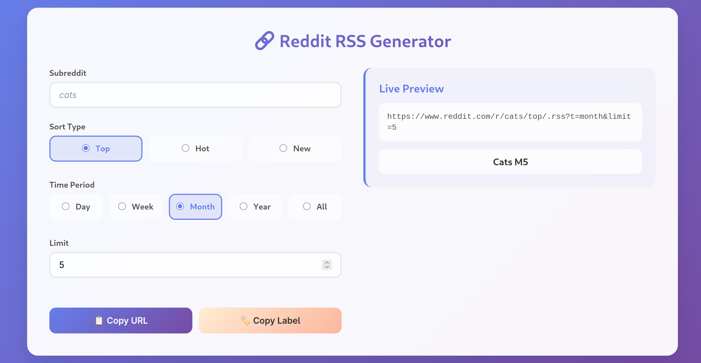

# Reddit RSS Feed URL Generator

## ✅ Project Status: COMPLETED

A lightweight, single-file tool that runs locally in your browser to generate RSS feed URLs for Reddit subreddits. No containers, no server setup, no dependencies - just open the HTML file and start generating URLs.

## 🔍 Use Case

This tool solves the problem of manually constructing Reddit RSS feed URLs with the correct parameters. Instead of remembering the URL structure and parameters, users can:

1. Enter a subreddit name
2. Select sorting options (Top, Hot, New)
3. Choose a time period (Day, Week, Month, Year, All)
4. Set a post limit
5. Get an instantly generated URL ready to use in any RSS reader

Perfect for users who want to follow specific subreddits in their preferred RSS reader without dealing with the Reddit interface.

## ⚡ Features

- **Simple & Lightweight**: Single HTML file, runs entirely in your browser
- **No Installation**: No dependencies, containers, or server setup required
- **Customizable Parameters**:
  - Sort type (Top, Hot, New)
  - Time period (Day, Week, Month, Year, All)
  - Post limit
- **Live Preview**: See the generated URL update in real-time
- **One-Click Copy**: Copy the URL or label with a single click
- **Offline Capable**: Works without an internet connection once loaded

## 🚀 Usage

1. Download the HTML file
2. Open it in any modern web browser
3. Enter the subreddit name
4. Select your preferred options
5. Copy the generated URL to your RSS reader

## 💻 Technical Details

- Pure HTML, CSS, and JavaScript
- No external dependencies
- No data collection or tracking
- Runs entirely client-side
